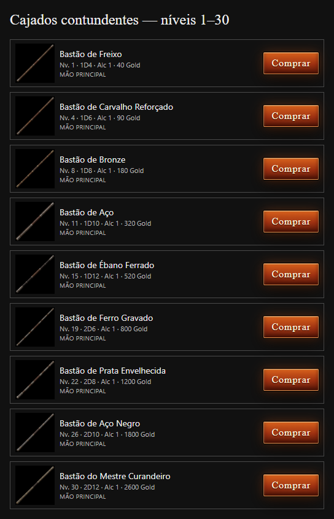

# Healer blunt staffs and mage staff passives

Created with the built-in imagegen tool. The complete prompt set and untouched generated source paths are in [generation-manifest.json](generation-manifest.json). Reference photographs were used to guide natural wood, leather, aged metal and realistic lighting. The original reference images and earlier game weapon artwork were preserved.

Nine distinct 1254 × 1254 RGBA PNGs are installed in `C:/Engine2/public/game/icons/weapons/`. Each has genuine zero-alpha background pixels; transparency is not painted into the image. The nine weapons use Ember's existing damage and price ladder. Levels are recommended campaign milestones, not new equipment restrictions.

| Tier | Recommended level | Weapon | Damage | Range | Price (Gold) | PNG filename |
|---|---:|---|---|---:|---:|---|
| 1 | 1 | Bastão de Freixo | 1D4 | 1 | 40 | bastao-curandeiro-01-freixo.png |
| 2 | 4 | Bastão de Carvalho Reforçado | 1D6 | 1 | 90 | bastao-curandeiro-02-carvalho.png |
| 3 | 8 | Bastão de Bronze | 1D8 | 1 | 180 | bastao-curandeiro-03-bronze.png |
| 4 | 11 | Bastão de Aço | 1D10 | 1 | 320 | bastao-curandeiro-04-aco.png |
| 5 | 15 | Bastão de Ébano Ferrado | 1D12 | 1 | 520 | bastao-curandeiro-05-ebano.png |
| 6 | 19 | Bastão de Ferro Gravado | 2D6 | 1 | 800 | bastao-curandeiro-06-ferro-gravado.png |
| 7 | 22 | Bastão de Prata Envelhecida | 2D8 | 1 | 1200 | bastao-curandeiro-07-prata.png |
| 8 | 26 | Bastão de Aço Negro | 2D10 | 1 | 1800 | bastao-curandeiro-08-aco-negro.png |
| 9 | 30 | Bastão do Mestre Curandeiro | 2D12 | 1 | 2600 | bastao-curandeiro-09-mestre.png |

These blunt staffs are usable by Healer, Salazar, Bishop and Cleric. All appear in the blacksmith for compatible characters. Their damage, enhancements and inventory ownership use the existing weapon system.

The 13 earlier ornate Healer staffs retain their IDs, damage dice, price and image files, and are now exclusive to Mage, Voss, Elementalist, Warlock, Conjurer, Sorcerer and Necromancer.

| Earlier staff | Basic attack element | MAG bonus | DEX bonus | Regeneration | Life drain | Elemental resistances | Elemental damage bonuses |
|---|---|---:|---:|---|---|---|---|
| Cajado da Renovação | Arcane | +1 | 0 | 2 HP/turn | 0% | Ice +10% | None |
| Cajado da Esperança | Holy | 0 | 0 | 3 HP/turn | 0% | Darkness +15% | Holy +10% |
| Cajado da Graça | Arcane | +2 | +2 | 0 HP/turn | 0% | Holy +15% | Arcane +10% |
| Cetro da Luz | Holy | +2 | 0 | 0 HP/turn | 0% | Darkness +20% | Holy +20% |
| Bastão da Purificação | Holy | 0 | 0 | 2 HP/turn | 0% | Poison +25%; Fire +10% | Holy +10% |
| Cajado do Bispo | Holy | +3 | 0 | 0 HP/turn | 0% | Holy +25%; Darkness +15% | Holy +15%; Arcane +10% |
| Cajado da Comunhão | Arcane | +3 | 0 | 0 HP/turn | 10% | Arcane +20% | Arcane +10% |
| Cajado da Fé | Holy | +4 | 0 | 0 HP/turn | 0% | Darkness +30%; Holy +25%; Ember +15% | Holy +15% |
| Cajado da Justiça | Holy | +5 | 0 | 0 HP/turn | 0% | Darkness +25%; Lightning +20% | Holy +25%; Arcane +15% |
| Bastão da Purificação Sombria | Darkness | +2 | 0 | 0 HP/turn | 10% | Poison +20%; Darkness +20% | Darkness +20% |
| Cajado da Vinha | Poison | 0 | 0 | 2 HP/turn | 0% | Poison +15% | Poison +10% |
| Cajado da Galhada | Arcane | +1 | 0 | 1 HP/turn | 0% | Poison +10%; Ice +10% | None |
| Cajado da Trepadeira | Poison | 0 | 0 | 2 HP/turn | 0% | Poison +20% | Poison +15% |

Magic bonuses apply only while a compatible mage equips the staff. Regeneration triggers at the start of a living wielder's turn and cannot exceed max HP. Life drain heals from damage actually dealt to opponents, excluding overkill and off-hand strikes. Elemental bonuses apply before resistance and penetration, and full immunity still permits zero damage. Switching weapons removes the equipped bonuses without stacking them. Existing saves preserve old owned staffs and enhancements; incompatible Healers receive their free new staff in the wielded slot.

Validation: production build; ten artwork, blacksmith, save-preservation and gameplay integration tests; 21 existing weapon proficiency and resistance tests; local browser rendering of the real blacksmith component with production CSS and PNGs. [verification.json](verification.json) contains per-image alpha measurements. The visual check starts no game or preview server.

