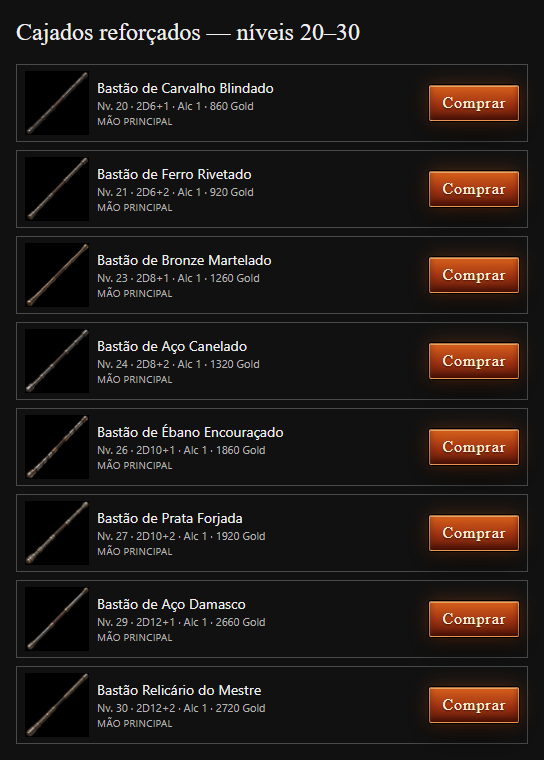

# Eight additional upper-tier Healer staffs

Eight separate photorealistic blunt quarterstaff PNGs, created with the built-in imagegen tool and true alpha transparency. All have stronger silhouettes than the early weapons: thicker shafts, heavy reinforced endcaps, broad metal collars and dense forged detail. They expand the Healer family from nine weapons to seventeen; the original weapons and PNGs remain intact.

The new weapons are shared by Healer, Salazar, Bishop and Cleric, and listed by the existing blacksmith. They use Ember's upper damage rungs with the existing second-lap flat bonus and price premium of 60 Gold per bonus point. These base bonuses are separate from the blacksmith's +1–+5 enhancement system. Levels remain recommended campaign milestones.

| ID | Recommended level | Weapon | Damage | Range | Price (Gold) | PNG filename |
|---|---:|---|---|---:|---:|---|
| 10 | 20 | Bastão de Carvalho Blindado | 2D6+1 | 1 | 860 | bastao-curandeiro-10-carvalho-blindado.png |
| 11 | 21 | Bastão de Ferro Rivetado | 2D6+2 | 1 | 920 | bastao-curandeiro-11-ferro-rivetado.png |
| 12 | 23 | Bastão de Bronze Martelado | 2D8+1 | 1 | 1260 | bastao-curandeiro-12-bronze-martelado.png |
| 13 | 24 | Bastão de Aço Canelado | 2D8+2 | 1 | 1320 | bastao-curandeiro-13-aco-canelado.png |
| 14 | 26 | Bastão de Ébano Encouraçado | 2D10+1 | 1 | 1860 | bastao-curandeiro-14-ebano-encouracado.png |
| 15 | 27 | Bastão de Prata Forjada | 2D10+2 | 1 | 1920 | bastao-curandeiro-15-prata-forjada.png |
| 16 | 29 | Bastão de Aço Damasco | 2D12+1 | 1 | 2660 | bastao-curandeiro-16-aco-damasco.png |
| 17 | 30 | Bastão Relicário do Mestre | 2D12+2 | 1 | 2720 | bastao-curandeiro-17-mestre-relicario.png |

Assets: `C:/Engine2/public/game/icons/weapons/`. The complete final prompt set and generated source paths are saved separately in [generation-manifest.json](generation-manifest.json). Original source files remain in the imagegen output directory.

Verified: production build and typecheck; all eleven staff tests; true PNG alpha on all seventeen assets; all seventeen loaded successfully in the locally rendered blacksmith component with production CSS; no browser errors. The original nine PNGs match their original generated source hashes. The visual check started no preview/game server.

[All seventeen staffs](staff-series.png) · [PNG alpha measurements and browser verification](verification.json)
